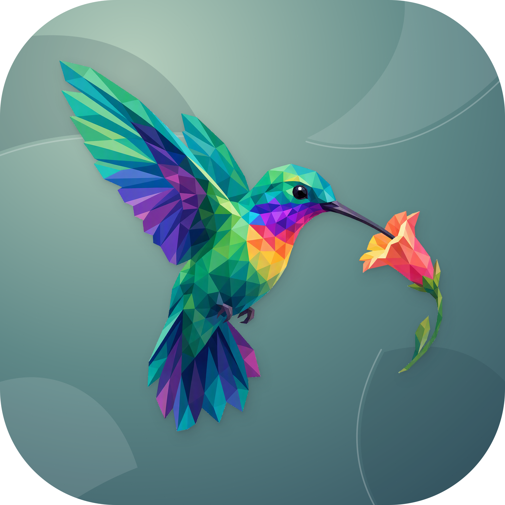

<p align="center">
  
</p>

<h1 align="center">Codo</h1>

<p align="center">Bring local script and Claude Code events to your Mac desktop, with project and session history in one place.</p>

<p align="center">
  <a href="../README.md">简体中文</a>
</p>

## What it does

Codo combines a macOS menu bar app with a Bun CLI. Scripts send messages over a Unix socket and the app displays desktop banners. A Claude Code hook forwards task completion, tool results, and events that need attention through the same path.

The native Dashboard organizes events, history, and logs by project and session. An optional AI Guardian decides whether to notify based on recent events and writes Chinese summaries. Basic notifications do not require a model or API key.

## Features

- Send titles, bodies, and subtitles through command-line arguments or stdin JSON, with ready-made notification templates.
- Display messages sequentially in custom AppKit banners; hover to pause dismissal or close a banner manually.
- Receive Claude Code Stop, SubagentStop, Notification, PostToolUse, PostToolUseFailure, SessionStart, and SessionEnd events.
- Inspect active sessions, project events, notification history, Guardian decisions, and logs in a SwiftUI Dashboard.
- Persist events and statistics in SQLite, keep API keys in macOS Keychain, and launch at login.
- Enable Guardian from the source checkout to curate notifications through Anthropic / OpenAI-compatible APIs, falling back to basic rules when a call fails or Guardian is unavailable.

The current app uses custom banners. Fields such as `sound` and `threadId` remain in the CLI protocol, but the banner implementation neither plays notification sounds nor merges messages by thread. Guardian only sends or suppresses notifications; it does not execute terminal commands.

## Usage

### Build and install

Requires macOS 14+, a Swift toolchain, full Xcode, Bun, and an available Apple Development signing identity. Clone the repository and install dependencies using the development steps below, and update the signing identity and team in `scripts/build.sh` to your own configuration before running:

```bash
bash scripts/build.sh
bash scripts/install.sh
open ~/Applications/Codo.app
```

The installer copies the app to `~/Applications/Codo.app` and the CLI and hook scripts to `~/.codo/`. If `/usr/local/bin` is writable, it creates a `codo` wrapper there. Otherwise, substitute `bun ~/.codo/codo.ts` for `codo` below.

```bash
codo "Build complete" "Ready for review"
codo "Build complete" "Checks passed" --template success
codo "Build failed" "See the build log" --template error
codo --template list

echo '{"title":"Build complete","body":"Ready for review"}' | codo
```

| Option | Purpose |
| --- | --- |
| `--template <name>` | Set default subtitle and protocol sound fields from a template |
| `--subtitle <text>` | Set a subtitle, overriding the template |
| `--thread <id>` | Set the protocol thread ID |
| `--silent` | Set the protocol sound field to `none` |
| `--hook <type>` | Send stdin JSON as a specified hook event |
| `--help` / `--version` | Show help or version |

Templates are `success`, `error`, `warning`, `info`, `progress`, `question`, `deploy`, and `review`. The CLI exits with `2` when the daemon is unavailable and `1` for invalid input or a rejected request.

### Claude Code integration

Merge this into your Claude Code `settings.json`, preserving existing hooks. This example connects task-stop and notification events:

```json
{
  "hooks": {
    "Stop": [
      { "hooks": [{ "type": "command", "command": "~/.codo/hooks/claude-hook.sh" }] }
    ],
    "Notification": [
      { "hooks": [{ "type": "command", "command": "~/.codo/hooks/claude-hook.sh" }] }
    ]
  }
}
```

Other supported events can use the same script; see [Claude Code hook integration](features/04-claude-hook-integration.md) for the full configuration. The hook forwards events and logs delivery, returning `0` if sending fails. Set `CODO_DEBUG_HOOKS=1` for diagnostics. Installed CLI/hook files are copies; recopy them or rerun the installer after editing their source.

### Guardian and data

Configure the model provider, base URL, model name, and API key in Dashboard settings, then enable Guardian. Model requests include relevant hook content and recent project context. Guardian's current prompt requires Simplified Chinese notifications.

The current `build.sh` does not copy `guardian/` or its dependencies into the `.app`, so the installed app under `~/Applications` normally cannot start Guardian. To use it, install dependencies, build the app, and launch the bundle within the checkout so it can find `guardian/main.ts` in a parent directory:

```bash
open .build/release/Codo.app
```

Basic notifications work without those packaged Guardian files. Guardian also needs a discoverable Bun executable, its enable setting, and a valid API key.

| Local path | Contents |
| --- | --- |
| `~/.codo/codo.sock` | Unix socket between CLI and app |
| `~/.codo/codo.db` | Dashboard events and statistics |
| `~/.codo/hooks.log` | Hook delivery log |
| `~/.codo/guardian.log` | Guardian process log |

## Development

Start at the repository root. The Swift package declares Swift 5.10; current unit tests use Swift Testing and require an Xcode toolchain that includes it.

```bash
git clone https://github.com/nocoo/codo.git
cd codo
bun install --frozen-lockfile
cd guardian
bun install --frozen-lockfile
cd ..

swift build
bun cli/codo.ts --help
```

`swift build` compiles the app, core library, and test server. A desktop `.app` also needs packaging with `build.sh` above. SwiftLint and Biome provide static checks: run `swiftlint lint --strict --quiet` and run `bunx biome check --error-on-warnings .` separately inside `cli/` and `guardian/`.

```text
Sources/Codo/          Menu bar app, banners, and native Dashboard
Sources/CodoCore/      IPC, message routing, SQLite, and Guardian lifecycle
Sources/CodoTestServer/ Isolated test server
cli/                  Bun CLI
guardian/             Event classification, context, and model calls
hooks/                Claude Code hook entry
scripts/              Build, installation, and test helpers
docs/                 Architecture, feature records, and this English README
```

## Tests

Run from the repository root:

| Layer | Command |
| --- | --- |
| Swift unit tests | `swift test` |
| CLI unit and process tests | `cd cli && bun test` |
| Guardian unit tests | `cd guardian && bun test` |
| Unix socket integration tests | `bash scripts/integration-test.sh` |
| Manual native UI checks | `bash scripts/e2e-test.sh` |

Start each row separately from the root. Integration tests build `CodoTestServer` and use a temporary home directory and socket to exercise real Swift/Bun communication. Guardian unit tests mock model calls and need no real credentials. The native UI script rebuilds, stops existing Codo processes, and restarts the app; it requires an interactive Mac desktop and human confirmation of banners, menus, and Guardian behavior. It is not an unattended automated test.

## Stack


| Area | Implementation |
| --- | --- |
| Mac app | Swift, SwiftUI, AppKit, Swift Package Manager |
| Communication and storage | Unix domain sockets, newline-delimited JSON, SQLite, Keychain |
| CLI / Guardian | TypeScript, Bun, Anthropic SDK, OpenAI SDK |
| Tests | Swift Testing, Bun test, local IPC test server |

See [Package.swift](../Package.swift), the [CLI package](../cli/package.json), and [Guardian package.json](../guardian/package.json) for dependencies.

## Documentation

- [Documentation index](README.md)
- [System design](architecture/01-system-design.md)
- [IPC protocol](architecture/02-ipc-protocol.md)
- [Notification templates](features/01-notification-templates.md)
- [Guardian design](features/03-ai-guardian-detail.md)
- [Dashboard](features/05-dashboard.md)
- [Unified logs](features/08-dashboard-log-unification.md)
- [Changelog](../CHANGELOG.md)

Some design documents and manual checks describe the earlier system-notification implementation. The current app entry uses the custom banners described above.

## License

[MIT](../LICENSE) © 2026 Zheng Li
